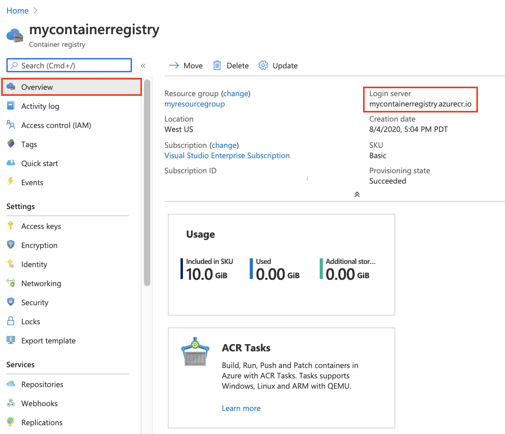

## What is ACR?

## Create an ACR with Azure CLI

1. Azure Login

```bash
az login
```

2. Create resource group

```bash
az group create --name myResourceGroup --location eastus
```

3. Create container registry

```bash
az acr create --resource-group myResourceGroup --name mycontainerregistry --sku Basic
```

4. Login into registry

```bash
az acr login --name <registry-name>
```

5. Pull hello-world image from mcr registry.

```bash
docker pull mcr.microsoft.com/hello-world
```

6. Create a tag for our image

```bash
docker tag mcr.microsoft.com/hello-world <login-server>/hello-world:v1
```

7. Push our tagged image

```bash
docker push <login-server>/hello-world:v1
```

8. Remove local images.

```bash
docker rmi <login-server>/hello-world:v1
docker rmi mcr.microsoft.com/hello-world:latest
```

9. List images from our registry

```bash
az acr repository list --name <registry-name> --output table
```

10. Show tags from an image

```bash
az acr repository show-tags --name <registry-name> --repository hello-world --output table
```

11. Run image from registry

```bash
docker run <login-server>/hello-world:v1
```

12. Clean up resources

```bash
az group delete --name myResourceGroup
```

## Create an ACR with Azure Portal

1. Select **Create a resource** > **Containers** > **Container Registry**.


2. Config your new container registry


3. Overview of my new container registry.



4. Login into registry

```bash
az acr login --name <registry-name>
```

5. Pull hello-world image from mcr registry.

```bash
docker pull mcr.microsoft.com/hello-world
```

6. Create a tag for our image

```bash
docker tag mcr.microsoft.com/hello-world <login-server>/hello-world:v1
```

7. Push our tagged image

```bash
docker push <login-server>/hello-world:v1
```

8. Remove local images.

```bash
docker rmi <login-server>/hello-world:v1
docker rmi mcr.microsoft.com/hello-world:latest
```

9. List images from our registry


10. Run image from registry

```bash
docker run <login-server>/hello-world:v1
```

11. Clean up resources


## Create an ACR with PowerShell

- [ ] completed

## Create an ACR with ARM Template

- [ ] completed

---

[Go README](../README.md)